# example flexbox

flexbox를 이용한 레이아웃 예제

 

## 📐 flex item의 width, height 계산

flex item의 너비, 높이 값은 (지정하지 않은 경우)  
메인축과 같은 방향이면 item의 content만큼  
교차축과 같은 방향이면 container에 `align-items`값이 없다면 container 크기를 가진다.

 
 
 
 
 

# Examples

1. [responsive login form](#responsive-login-form)
2. [responsive card](#responsive-card)
3. [responsive header navigation](#responsive-header-navigation-feat-hamburger-menu-button)
4. [responsive consulting application](#responsive-consulting-application)
5. [responsive gallery](#responsive-gallery)
6. [responsive post list](#responsive-post-list)

 
 
 

## responsive login form

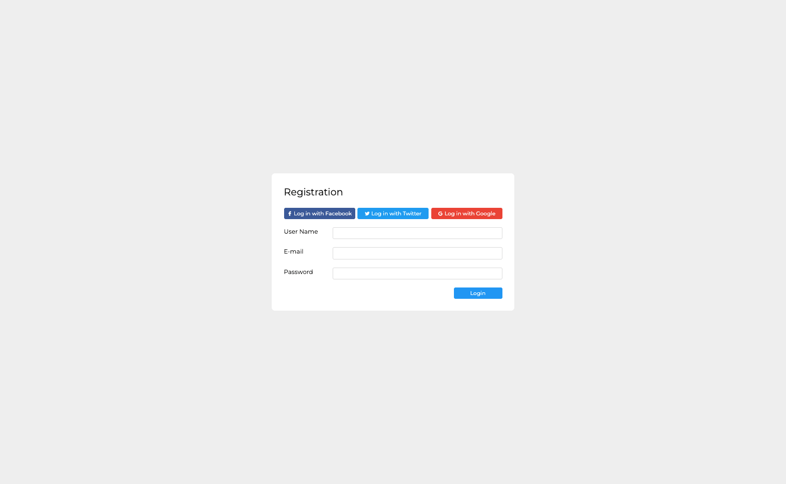
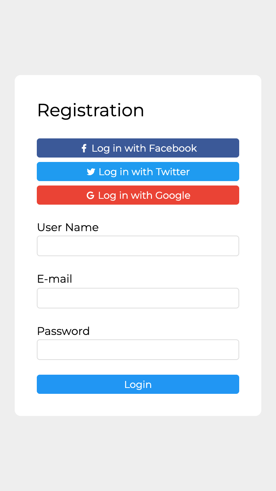

 

## responsive card

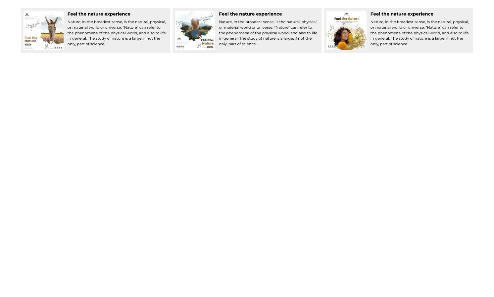
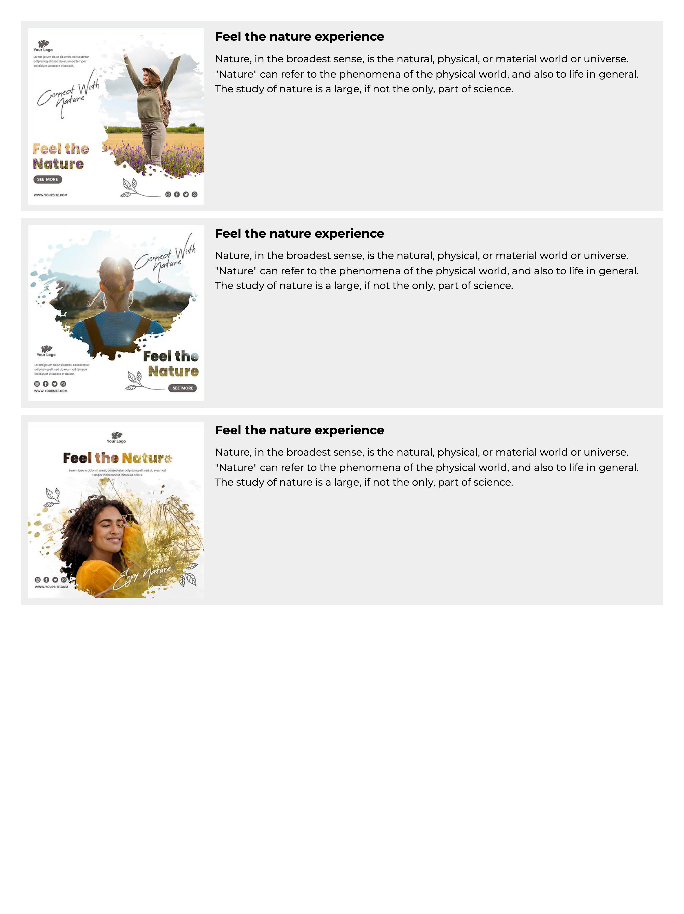
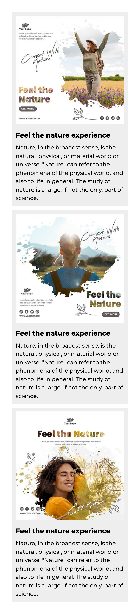

 

## responsive header navigation (feat. hamburger menu button)

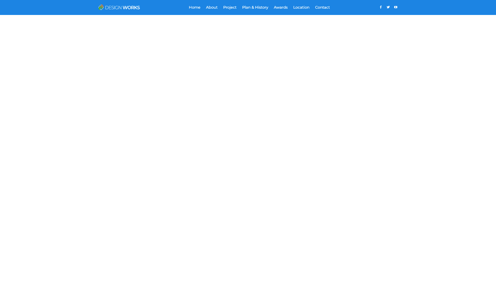
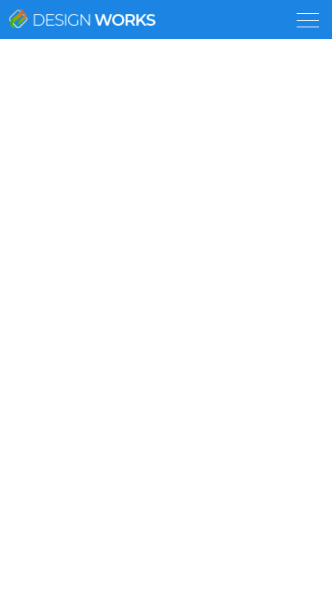
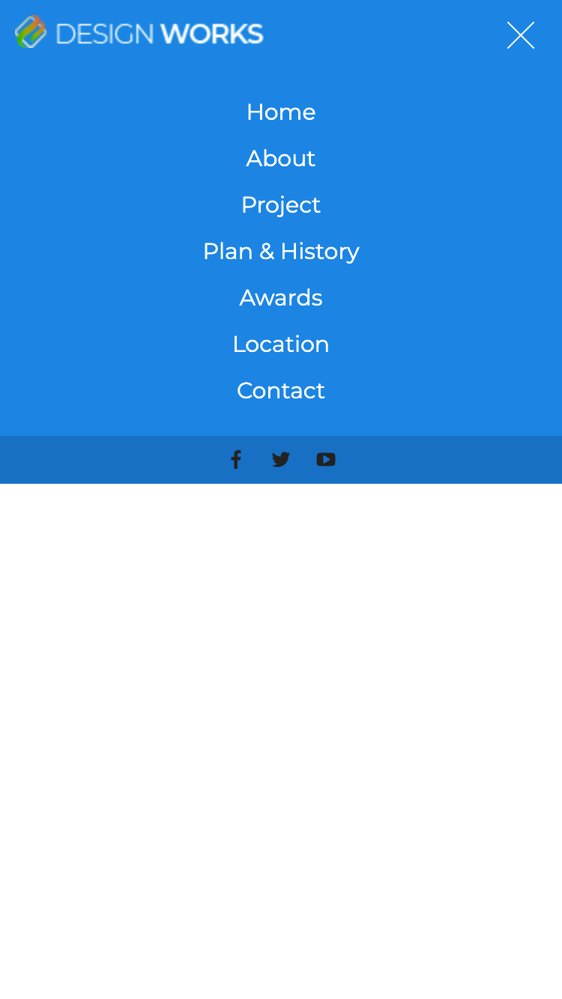

 

## responsive consulting application

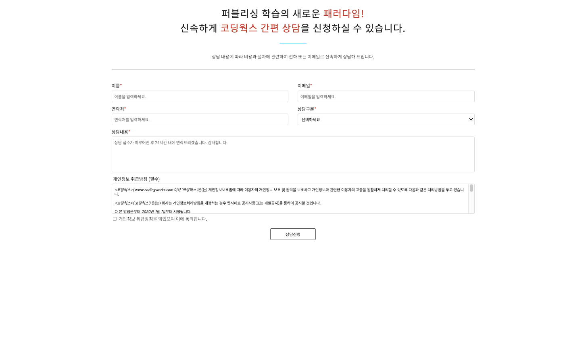
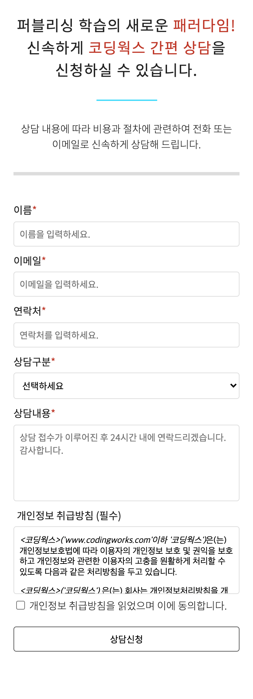

 

## responsive gallery

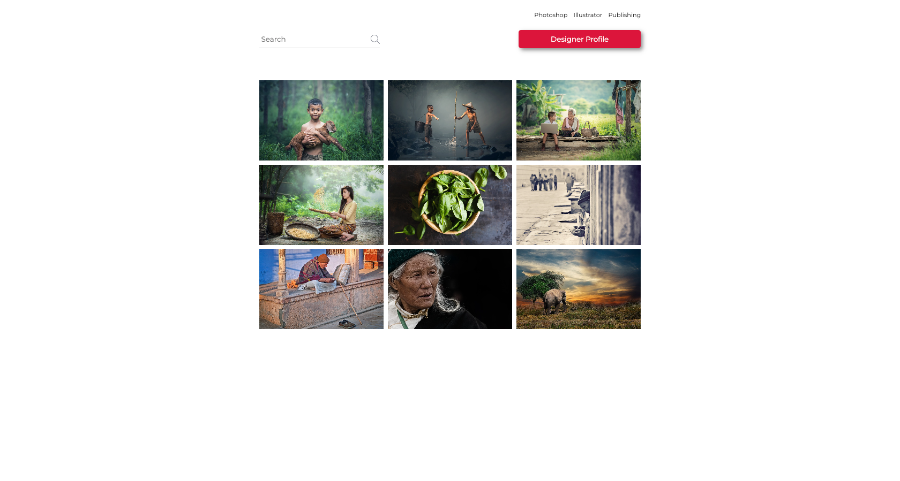

 

# responsive post list

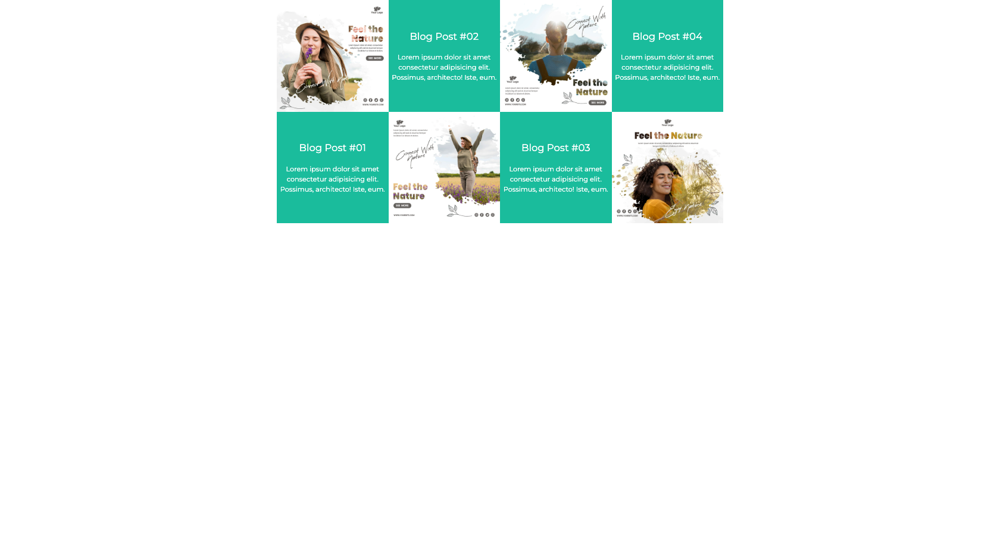
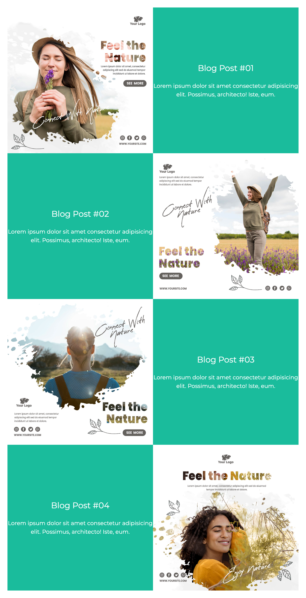
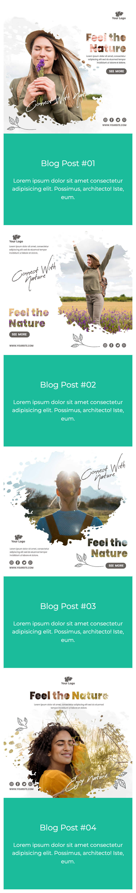
